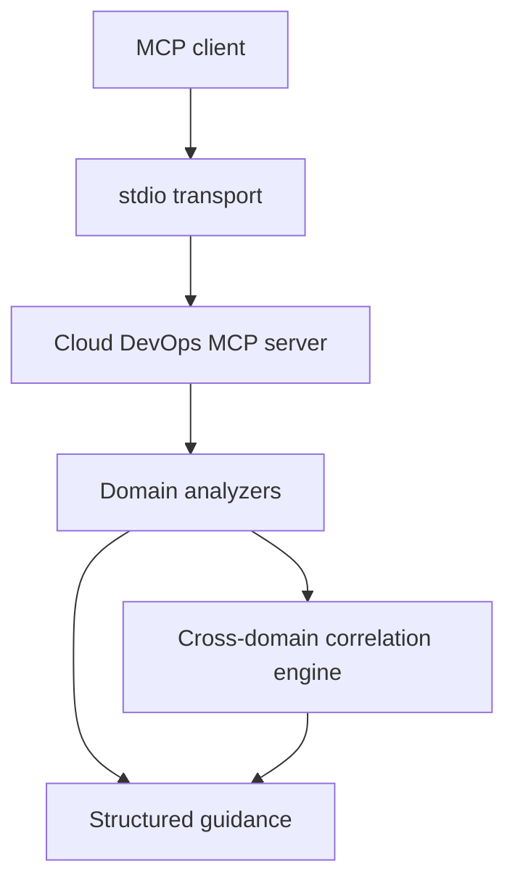

# Cloud DevOps MCP Server

[](https://github.com/alexcgodwin/cloud-devops-mcp-server/actions/workflows/ci.yml)
[](https://www.npmjs.com/package/cloud-devops-mcp-server)
[](https://registry.modelcontextprotocol.io/v0.1/servers?search=io.github.alexcgodwin%2Fcloud-devops-mcp-server)
[](LICENSE)
[](server.json)

Cloud DevOps MCP Server is a Model Context Protocol v2 server by Alex C. Godwin. It gives MCP clients practical Cloud DevOps tools for infrastructure risk review, incident response, CI/CD readiness and SLO error budget analysis.

The v0.3 line adds cross-domain change correlation on top of evidence-backed analysis. Tools can inspect Terraform plan JSON, AWS IAM policy JSON, Kubernetes YAML and GitHub Actions workflow YAML directly, while `assess_cloud_change_bundle` connects those findings into one release-risk view with domain summaries, correlated findings and potential change paths.

## Table of contents

- [Why this exists](#why-this-exists)
- [Tools](#tools)
- [Architecture](#architecture)
- [Quickstart](#quickstart)
- [Install from npm](#install-from-npm)
- [MCP clients](#mcp-clients)
- [Configuration](#configuration)
- [Public release verification](#public-release-verification)
- [Example tool input](#example-tool-input)
- [Demo outputs](#demo-outputs)
- [Docker](#docker)
- [Development](#development)
- [Security model](#security-model)
- [Roadmap](#roadmap)
- [Author](#author)

## Why this exists

AI assistants are more useful in engineering work when they can call focused tools with clear inputs and consistent outputs. This server provides a Cloud DevOps tool layer for:

- Cross-domain release-risk correlation across infrastructure, identity, runtime and delivery.
- Infrastructure-as-code deployment risk analysis.
- Production incident runbook generation.
- CI/CD delivery readiness review.
- SLO error budget calculations.
- AWS IAM least-privilege review.
- Kubernetes workload production readiness review.
- GitHub Actions workflow security and deployment review.

## Tools

| Tool | Purpose |
| --- | --- |
| `assess_cloud_change_bundle` | Correlates Terraform, IAM, Kubernetes and GitHub Actions evidence into one deployment-risk assessment with cross-domain change paths. |
| `assess_terraform_change` | Scores Terraform/IaC risk and can derive evidence from raw Terraform plan JSON. |
| `build_incident_runbook` | Produces a practical incident response runbook for a service, symptom, environment and severity. |
| `review_cicd_pipeline` | Reviews CI/CD maturity while separating failed controls from unknown evidence. |
| `estimate_slo_error_budget` | Calculates downtime and request-failure budgets with consistency validation. |
| `review_iam_policy` | Parses IAM policy JSON and detects wildcard scope and privilege-escalation paths. |
| `review_kubernetes_deployment` | Parses Kubernetes YAML for probes, resources, disruption protection, image and exposure risks. |
| `review_github_actions_workflow` | Parses workflow YAML for triggers, immutable action pins, permissions, caching and concurrency. |

## Architecture



## Quickstart

Run the published MCP server directly from npm:

```bash
npx -y cloud-devops-mcp-server@0.3.1
```

On Windows PowerShell systems where script execution policy blocks `npx.ps1`, use:

```powershell
npx.cmd -y cloud-devops-mcp-server@0.3.1
```

## Install from npm

Install the CLI globally if you prefer a persistent local command:

```bash
npm install -g cloud-devops-mcp-server@0.3.1
cloud-devops-mcp-server
```

The package is published on npm as `cloud-devops-mcp-server` and registered in the official MCP Registry as `io.github.alexcgodwin/cloud-devops-mcp-server`.

## MCP clients

Cloud DevOps MCP Server is designed for MCP clients that support stdio servers, including:

- Cursor
- Claude Desktop
- VS Code with MCP support
- Claude Code
- Other clients that follow the Model Context Protocol stdio transport

Use any MCP host that supports local stdio servers. The server does not require cloud credentials or a hosted endpoint.

## Configuration

For MCP clients that support local stdio servers, the recommended public configuration is:

```json
{
  "mcpServers": {
    "cloud-devops": {
      "command": "npx",
      "args": ["-y", "cloud-devops-mcp-server@0.3.1"]
    }
  }
}
```

Windows clients can use `npx.cmd` if `npx` resolves through a blocked PowerShell wrapper:

```json
{
  "mcpServers": {
    "cloud-devops": {
      "command": "npx.cmd",
      "args": ["-y", "cloud-devops-mcp-server@0.3.1"]
    }
  }
}
```

See [docs/configuration.md](docs/configuration.md) for npm, global-install and source-development configuration options.

## Public release verification

The published `0.2.1` package was acceptance-tested from a clean directory using the npm-installed CLI and the exact public `npx` command. The test discovered all seven tools, executed all seven successfully through stdio, verified structured outputs, rejected malformed input, and found no credential, private-key, token or `.env` files in the published package.

See [docs/public-acceptance.md](docs/public-acceptance.md) for the verification record.

## Example tool input

```json
{
  "changedResources": ["network", "iam", "kubernetes"],
  "includesIamChanges": true,
  "includesPublicIngress": true,
  "modifiesStatefulResources": false,
  "hasRollbackPlan": true,
  "hasPeerReview": true,
  "hasTerraformPlan": true
}
```

Example output shape:

```json
{
  "riskScore": 78,
  "riskLevel": "critical",
  "changedResources": ["network", "iam", "kubernetes"],
  "recommendedReleasePath": "Change-advisory review, maintenance window and staged execution are recommended."
}
```

## Demo outputs

See [docs/demo.md](docs/demo.md) for practical sample inputs and outputs across the toolset.

## Docker

Build and run the server in a container:

```bash
docker build -t cloud-devops-mcp-server .
docker run --rm -i cloud-devops-mcp-server
```

## Development

```bash
npm run dev
npm run build
npm test
npm run check
```

The core decision logic lives in `src/logic.ts` and the MCP tool registration lives in `src/index.ts`.

More project notes are available in [DEVELOPMENT.md](DEVELOPMENT.md), [RELEASE.md](RELEASE.md) and [docs/architecture.md](docs/architecture.md).

## Security model

- The server runs locally over stdio.
- It does not require cloud credentials.
- It does not call external APIs.
- It does not write to infrastructure or mutate user systems.
- It returns advisory guidance only; engineers remain responsible for review, approval and execution.

## Roadmap

- Expand Terraform plan evidence rules across AWS, Azure and Google Cloud resources.
- Add read-only cloud inventory checks with explicitly scoped credentials.
- Add hosted Streamable HTTP transport with authentication and tenant isolation.
- Add signed release provenance, SBOM generation and automated npm/MCP Registry publication.
- Expand cross-domain correlation with policy packs for identity, data, networking and supply-chain risk.
- Add machine-readable policy profiles for production, staging and regulated workloads.

## Author

Built by [Alex C. Godwin](https://github.com/alexcgodwin), Cloud DevOps Engineer.
