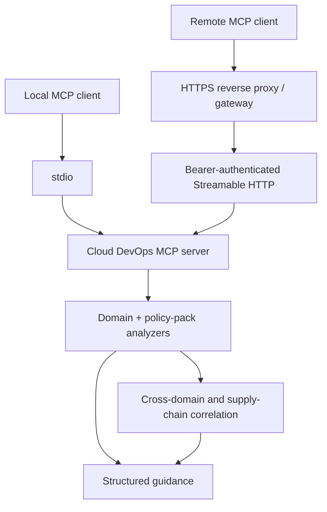

# Cloud DevOps MCP Server

<!-- mcp-name: io.github.alexcgodwin/cloud-devops-mcp-server -->

[](https://github.com/alexcgodwin/cloud-devops-mcp-server/actions/workflows/ci.yml)
[](https://www.npmjs.com/package/cloud-devops-mcp-server)
[](https://registry.modelcontextprotocol.io/v0.1/servers?search=io.github.alexcgodwin%2Fcloud-devops-mcp-server)
[](LICENSE)
[](server.json)

Cloud DevOps MCP Server is a Model Context Protocol v2 server by Alex C. Godwin. It provides evidence-backed Cloud DevOps analysis across infrastructure, identity, Kubernetes, CI/CD, SRE and software supply-chain controls.

The v0.11 line adds an opt-in OpsChugex policy and governance gateway. The public MCP sends bounded resource evidence and approved exception metadata to a host-configured private OpsChugex service and returns pass, review or block decisions with control findings and evidence gaps. Proprietary profiles, rules, weights and exception-processing logic are not included in this public MIT repository.

The v0.10 line adds an opt-in OpsChugex root-cause intelligence gateway. The public MCP sends bounded incident evidence to a host-configured private OpsChugex service and returns evidence-ranked probable causes, contradictions, limitations and next checks. Proprietary ranking and correlation rules are not included in this public MIT repository.

The v0.9 line adds an opt-in distributed-tracing and SLO-intelligence plane for Grafana Tempo and Jaeger v3 trace reads, service dependency mapping, tracing coverage assessment, multi-window SLO burn-rate analysis and trace/SLO incident correlation. The v0.8 production-observability and operations-intelligence plane remains available for Prometheus, Grafana, CloudWatch Logs Insights, Kubernetes health, GitHub Actions diagnosis, cloud health, FinOps and drift. Live AWS, Azure and GCP access remains bounded and read-only. Cloud mutation remains intentionally unavailable.

## Table of contents

- [Why this exists](#why-this-exists)
- [Tools](#tools)
- [Architecture](#architecture)
- [Quickstart](#quickstart)
- [Install from npm](#install-from-npm)
- [MCP clients](#mcp-clients)
- [Configuration](#configuration)
- [Authenticated Streamable HTTP](#authenticated-streamable-http)
- [Public release verification](#public-release-verification)
- [Example tool input](#example-tool-input)
- [Demo outputs](#demo-outputs)
- [Docker](#docker)
- [Development](#development)
- [Security model](#security-model)
- [Roadmap](#roadmap)
- [Author](#author)

## Why this exists

AI assistants are more useful in engineering work when they can call focused tools with clear inputs and consistent outputs. This server provides a Cloud DevOps tool layer for:

- Cross-domain release-risk correlation across infrastructure, identity, runtime and delivery.
- Infrastructure-as-code deployment risk analysis.
- Production incident runbook generation.
- CI/CD delivery readiness review.
- SLO error budget calculations.
- AWS IAM least-privilege review.
- AWS, Azure and GCP identity policy packs.
- Terraform destructive-change, public exposure and encryption security analysis.
- Kubernetes workload production readiness and security-policy analysis.
- GitHub Actions workflow security and deployment review.
- CycloneDX/SPDX SBOM quality and software supply-chain correlation.
- Optional authenticated Streamable HTTP serving for self-hosted remote access.
- Optional allowlisted live AWS/Azure/GCP inventory, observability, FinOps and drift signals.
- Optional Grafana Tempo and Jaeger v3 trace reads, service dependency maps and SLO burn-rate intelligence.
- Optional OpsChugex private root-cause intelligence across metrics, logs, traces, Kubernetes, cloud, Terraform and CI/CD evidence.
- Optional OpsChugex private policy and governance intelligence for development, staging, production and regulated profiles.

## Tools

| Tool | Purpose |
| --- | --- |
| `assess_cloud_change_bundle` | Correlates Terraform, IAM, Kubernetes and GitHub Actions evidence into one deployment-risk assessment with cross-domain change paths. |
| `assess_terraform_change` | Scores Terraform/IaC risk and can derive evidence from raw Terraform plan JSON. |
| `build_incident_runbook` | Produces a practical incident response runbook for a service, symptom, environment and severity. |
| `review_cicd_pipeline` | Reviews CI/CD maturity while separating failed controls from unknown evidence. |
| `estimate_slo_error_budget` | Calculates downtime and request-failure budgets with consistency validation. |
| `review_iam_policy` | Parses IAM policy JSON and detects wildcard scope and privilege-escalation paths. |
| `review_kubernetes_deployment` | Parses Kubernetes YAML for probes, resources, disruption protection, image and exposure risks. |
| `review_github_actions_workflow` | Parses workflow YAML for triggers, immutable action pins, permissions, caching and concurrency. |
| `review_cloud_identity_policy` | Applies AWS IAM, Azure RBAC or GCP IAM policy packs to raw policy JSON. |
| `review_terraform_security` | Reviews Terraform plan JSON for destructive changes, public exposure, encryption, deletion protection and wildcard IAM. |
| `review_kubernetes_security` | Reviews privileged mode, host access, service accounts, capabilities, seccomp, root filesystems and NetworkPolicy. |
| `review_software_supply_chain` | Correlates CycloneDX/SPDX SBOM quality with CI action pinning, image immutability, signatures and provenance. |

### Optional live multi-cloud reads

When explicitly enabled, six additional tools provide allowlisted AWS/Azure/GCP identity verification, bounded inventory, managed Kubernetes discovery, observability configuration summaries, FinOps waste signals and drift reporting. No cloud mutation commands are exposed. AWS general inventory is sourced from the Resource Groups Tagging API, so untagged AWS resources may not appear in that inventory or AWS drift comparison.

### Optional production observability intelligence

When explicitly enabled, twelve additional tools provide bounded Prometheus queries, Grafana alert summaries, CloudWatch Logs Insights queries, Kubernetes pod-health summaries, GitHub Actions failure diagnosis, cross-signal incident correlation, cloud-health assessment, deployment/incident correlation, observability coverage assessment, FinOps correlation, cross-runtime drift analysis and operations briefs. Endpoints, cloud scopes, log groups, cluster contexts, namespaces and repositories are allowlisted. The layer is read-only and exposes no alert mutation, deployment mutation or arbitrary shell execution.

### Optional distributed tracing and SLO intelligence

When explicitly enabled, six additional v0.9 tools provide bounded Tempo/Jaeger trace search and retrieval, service dependency mapping, tracing coverage assessment, multi-window SLO burn-rate analysis and trace/SLO incident correlation. Remote tracing endpoints must be allowlisted and use HTTPS unless loopback. Backend credentials stay in host environment variables. Trace search windows and result sizes are bounded, and the plane exposes no trace ingestion, sampling mutation or telemetry deletion.

### Optional OpsChugex root-cause intelligence

When explicitly enabled, v0.10 exposes `diagnose_root_cause`. The tool accepts bounded evidence from metrics, logs, traces, Kubernetes, cloud, Terraform and CI/CD, then calls a host-configured private OpsChugex service. The public MCP contains no proprietary ranking rules, accepts no service URL or credential as tool input, and performs no remediation. Evidence scores represent evidence strength rather than statistical probability.

### Optional OpsChugex policy and governance intelligence

When explicitly enabled, v0.11 exposes `assess_governance_policy`. The tool accepts bounded factual resource evidence plus optional owner-attributed, time-bounded exceptions and forwards them to the private OpsChugex policy engine. It returns `pass`, `review`, or `block` with control findings and evidence gaps.

The public MCP contains no proprietary governance profiles, policy rules, scoring weights, exception evaluation logic or enforcement capability. The service URL and token remain host-side and cannot be supplied as MCP arguments.

### Optional infrastructure operations

When explicitly enabled, six additional tools provide Terraform format/validation/plan summaries and Kubernetes read-only runtime inspection. These operations use repository, context, namespace and resource allowlists. Full Terraform plan JSON, Kubernetes Secrets, arbitrary shell execution, Terraform apply and Kubernetes mutation are deliberately excluded.
## Architecture



## Quickstart

Run the published MCP server directly from npm:

```bash
npx -y cloud-devops-mcp-server@0.11.0
```

On Windows PowerShell systems where script execution policy blocks `npx.ps1`, use:

```powershell
npx.cmd -y cloud-devops-mcp-server@0.11.0
```

## Install from npm

Install the CLI globally if you prefer a persistent local command:

```bash
npm install -g cloud-devops-mcp-server@0.11.0
cloud-devops-mcp-server
```

The package is published on npm as `cloud-devops-mcp-server` and registered in the official MCP Registry as `io.github.alexcgodwin/cloud-devops-mcp-server`.

## MCP clients

Cloud DevOps MCP Server supports local stdio clients and MCP clients capable of connecting to Streamable HTTP endpoints. Common local clients include:

- Cursor
- Claude Desktop
- VS Code with MCP support
- Claude Code
- Other clients that follow the Model Context Protocol stdio transport

Use stdio for normal local operation. For self-hosted remote access, start the optional authenticated Streamable HTTP endpoint and place non-local deployments behind an HTTPS reverse proxy or gateway.

## Configuration

For MCP clients that support local stdio servers, the recommended public configuration is:

```json
{
  "mcpServers": {
    "cloud-devops": {
      "command": "npx",
      "args": ["-y", "cloud-devops-mcp-server@0.11.0"]
    }
  }
}
```

Windows clients can use `npx.cmd` if `npx` resolves through a blocked PowerShell wrapper:

```json
{
  "mcpServers": {
    "cloud-devops": {
      "command": "npx.cmd",
      "args": ["-y", "cloud-devops-mcp-server@0.11.0"]
    }
  }
}
```

See [docs/configuration.md](docs/configuration.md) for npm, global-install, source-development and authenticated Streamable HTTP configuration options.

## Authenticated Streamable HTTP

Local loopback example:

```powershell
$env:CLOUD_DEVOPS_MCP_BEARER_TOKEN="<random secret at least 32 characters>"
npm run start:http
```

The MCP endpoint is `http://127.0.0.1:3000/mcp` and requires `Authorization: Bearer <token>`. A non-local bind additionally requires `CLOUD_DEVOPS_MCP_ALLOWED_HOSTS` and an HTTPS `CLOUD_DEVOPS_MCP_PUBLIC_BASE_URL` so remote traffic is expected to terminate TLS at a reverse proxy or gateway.

## Public release verification

The v0.11.0 release candidate passes 101 automated tests, with 85.68% statement, 72.02% branch, 85.30% function and 89.08% line coverage. The production dependency audit reports zero vulnerabilities. Public clean-install and MCP Registry acceptance are recorded after publication.

See [docs/public-acceptance.md](docs/public-acceptance.md) for the verification record.

## Example tool input

```json
{
  "changedResources": ["network", "iam", "kubernetes"],
  "includesIamChanges": true,
  "includesPublicIngress": true,
  "modifiesStatefulResources": false,
  "hasRollbackPlan": true,
  "hasPeerReview": true,
  "hasTerraformPlan": true
}
```

Example output shape:

```json
{
  "riskScore": 78,
  "riskLevel": "critical",
  "changedResources": ["network", "iam", "kubernetes"],
  "recommendedReleasePath": "Change-advisory review, maintenance window and staged execution are recommended."
}
```

## Demo outputs

See [docs/demo.md](docs/demo.md) for practical sample inputs and outputs across the toolset.

## Docker

Build and run the server in a container:

```bash
docker build -t cloud-devops-mcp-server .
docker run --rm -i cloud-devops-mcp-server
```

## Development

```bash
npm run dev
npm run build
npm test
npm run check
```

The core decision logic lives in `src/logic.ts` and the MCP tool registration lives in `src/index.ts`.

More project notes are available in [DEVELOPMENT.md](DEVELOPMENT.md), [RELEASE.md](RELEASE.md) and [docs/architecture.md](docs/architecture.md).

## Security model

- Stdio remains the default and requires no secrets.
- Optional Streamable HTTP requires a bearer token of at least 32 characters.
- Non-local HTTP binds require an explicit Host allowlist and an HTTPS public base URL for reverse-proxy/gateway termination.
- Host and Origin validation are enabled through the official MCP Fastify adapter.
- The default analysis tools do not require cloud credentials or call cloud APIs.
- Optional Terraform/Kubernetes operations may use locally configured provider or cluster credentials after explicit enablement and allowlisting.
- Optional live cloud reads use existing AWS CLI, Azure CLI or gcloud authentication and require explicit account/subscription/project allowlists.
- Optional production-observability reads require explicit endpoint/resource allowlists and host-managed credentials; returned logs and diagnostics are bounded and redacted.
- Optional v0.10 root-cause intelligence uses a host-configured HTTPS endpoint and host-side token; neither is accepted as a tool argument, and the proprietary ranking engine remains outside the public repository.
- Optional v0.11 governance intelligence uses a separately gated host-configured HTTPS endpoint and the same host-side OpsChugex token; proprietary policy rules and enforcement remain outside the public repository.
- No cloud mutation tool is exposed.
- Analysis remains read-only by default. Controlled execution appears only when explicitly enabled and allowlisted.
- No generic shell tool or force-push capability is exposed.
- Direct commit/push on protected branches is blocked, and high-impact GitHub actions require explicit confirmation.
- Analysis outputs are advisory. Optional operational tools remain bounded by explicit allowlists and fixed command/API surfaces.

## Roadmap

- **Current: v0.11.0 Policy & Governance Engine** - public gateway to private OpsChugex development, staging, production and regulated policy profiles, organization guardrails, tagging, encryption, network and IAM standards.
- **v0.12.0 Cloud Security Posture Intelligence** - deeper AWS/Azure/GCP misconfiguration detection, attack-path correlation, secrets and exposure analysis.
- **v0.13.0 Advanced FinOps Intelligence** - utilization trends, rightsizing evidence, cost anomalies, Kubernetes/cloud cost correlation and optimization plans.
- **v0.14.0 Change Intelligence & Blast-Radius Analysis** - predict affected services and resources before Terraform, Kubernetes or CI/CD changes.
- **v0.15.0 Controlled Remediation Gateway** - approval-gated safe fixes for selected cloud, Kubernetes and Terraform operational problems.
- **v0.16.0 Multi-Account / Multi-Organization Operations** - AWS Organizations, Azure tenants/subscriptions and GCP organizations/projects topology.
- **v0.17.0 Incident Command & Automated Runbooks** - incident timelines, evidence bundles, remediation plans, rollback recommendations and post-incident reports.
- **v0.18.0 Platform Engineering Intelligence** - service catalog, ownership, golden paths, environment health and developer-platform checks.
- **v0.19.0 Enterprise Authentication & Authorization** - OAuth/OIDC, RBAC, per-user scopes, stronger hosted-MCP access controls and audit trails.
- **v1.0.0 Production Stable Release** - stable tool contracts, compatibility guarantees, hardened security model, comprehensive documentation and enterprise-ready release standards.

## Author

Built by [Alex C. Godwin](https://github.com/alexcgodwin), Cloud DevOps Engineer.
