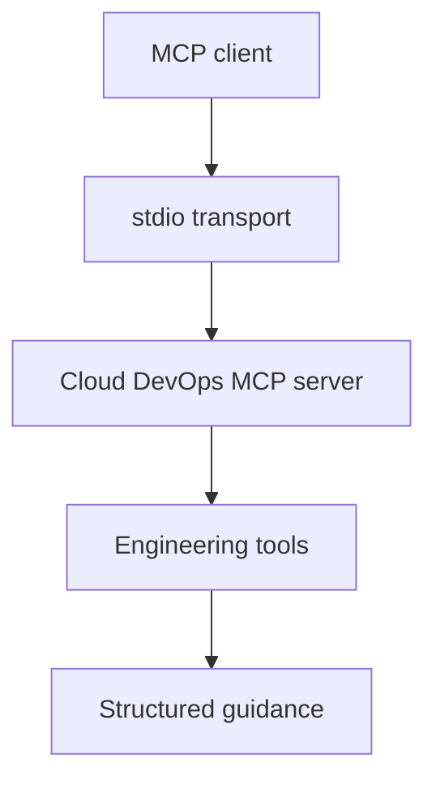

# Cloud DevOps MCP Server

[](https://github.com/alexcgodwin/cloud-devops-mcp-server/actions/workflows/ci.yml)
[](LICENSE)
[](server.json)

Cloud DevOps MCP Server is a Model Context Protocol server by Alex C. Godwin. It gives AI clients practical Cloud DevOps tools for infrastructure risk review, incident response, CI/CD readiness and SLO error budget analysis.

This project is intentionally focused on engineering judgment rather than generic chat. The server exposes tools that return structured operational guidance an assistant can use during platform work, pull request review, production readiness checks and incident preparation.

## Table of contents

- [Why this exists](#why-this-exists)
- [Tools](#tools)
- [Architecture](#architecture)
- [Quickstart](#quickstart)
- [MCP clients](#mcp-clients)
- [Configuration](#configuration)
- [Example tool input](#example-tool-input)
- [Demo outputs](#demo-outputs)
- [Docker](#docker)
- [Development](#development)
- [Security model](#security-model)
- [Roadmap](#roadmap)
- [Author](#author)

## Why this exists

AI assistants are more useful in engineering work when they can call focused tools with clear inputs and consistent outputs. This server provides a Cloud DevOps tool layer for:

- Infrastructure-as-code deployment risk analysis.
- Production incident runbook generation.
- CI/CD delivery readiness review.
- SLO error budget calculations.
- AWS IAM least-privilege review.
- Kubernetes workload production readiness review.
- GitHub Actions workflow security and deployment review.

## Tools

| Tool | Purpose |
| --- | --- |
| `assess_terraform_change` | Scores Terraform or IaC deployment risk using changed resource classes and release controls. |
| `build_incident_runbook` | Produces a practical incident response runbook for a service, symptom, environment and severity. |
| `review_cicd_pipeline` | Reviews CI/CD maturity and recommends gates for safer production delivery. |
| `estimate_slo_error_budget` | Calculates remaining downtime and optional request failure budget for an SLO window. |
| `review_iam_policy` | Reviews IAM policy risk, wildcard access and privilege-escalation paths. |
| `review_kubernetes_deployment` | Reviews Kubernetes workload production readiness controls. |
| `review_github_actions_workflow` | Reviews GitHub Actions workflow security and production deployment safety. |

## Architecture



## Quickstart

```bash
git clone https://github.com/alexcgodwin/cloud-devops-mcp-server.git
cd cloud-devops-mcp-server
npm install
npm run build
npm test
```

Run the server locally:

```bash
npm start
```

## MCP clients

Cloud DevOps MCP Server is designed for MCP clients that support stdio servers, including:

- Cursor
- Claude Desktop
- VS Code with MCP support
- Claude Code
- Other clients that follow the Model Context Protocol stdio transport

ChatGPT in a web browser does not currently load local `mcpServers` JSON from your laptop. To use this local server from your computer, connect it through a desktop MCP client such as Cursor, Claude Desktop or VS Code.

## Configuration

Use the built `dist/index.js` file from your local checkout.

```json
{
  "mcpServers": {
    "cloud-devops": {
      "command": "node",
      "args": ["/absolute/path/to/cloud-devops-mcp-server/dist/index.js"]
    }
  }
}
```

Windows example:

```json
{
  "mcpServers": {
    "cloud-devops": {
      "command": "node",
      "args": [
        "C:\\Users\\Owner\\Downloads\\cloud-devops-mcp-server-bootstrap\\dist\\index.js"
      ]
    }
  }
}
```

See [docs/configuration.md](docs/configuration.md) for client-specific setup notes.

## Example tool input

```json
{
  "changedResources": ["network", "iam", "kubernetes"],
  "includesIamChanges": true,
  "includesPublicIngress": true,
  "modifiesStatefulResources": false,
  "hasRollbackPlan": true,
  "hasPeerReview": true,
  "hasTerraformPlan": true
}
```

Example output shape:

```json
{
  "riskScore": 60,
  "riskLevel": "high",
  "changedResources": ["network", "iam", "kubernetes"],
  "recommendedReleasePath": "Use staged rollout, peer review and post-apply validation before broad release."
}
```

## Demo outputs

See [docs/demo.md](docs/demo.md) for practical sample inputs and outputs across the toolset.

## Docker

Build and run the server in a container:

```bash
docker build -t cloud-devops-mcp-server .
docker run --rm -i cloud-devops-mcp-server
```

## Development

```bash
npm run dev
npm run build
npm test
npm run check
```

The core decision logic lives in `src/logic.ts` and the MCP tool registration lives in `src/index.ts`.

More project notes are available in [DEVELOPMENT.md](DEVELOPMENT.md), [RELEASE.md](RELEASE.md) and [docs/architecture.md](docs/architecture.md).

## Security model

- The server runs locally over stdio.
- It does not require cloud credentials.
- It does not call external APIs.
- It does not write to infrastructure or mutate user systems.
- It returns advisory guidance only; engineers remain responsible for review, approval and execution.

## Roadmap

- Add Terraform plan JSON parsing.
- Add hosted HTTP transport for remote MCP clients.
- Add cloud inventory read-only checks for AWS, Azure and Kubernetes.
- Add signed hosted MCP authentication for remote clients.

## Author

Built by [Alex C. Godwin](https://github.com/alexcgodwin), Cloud DevOps Engineer.
