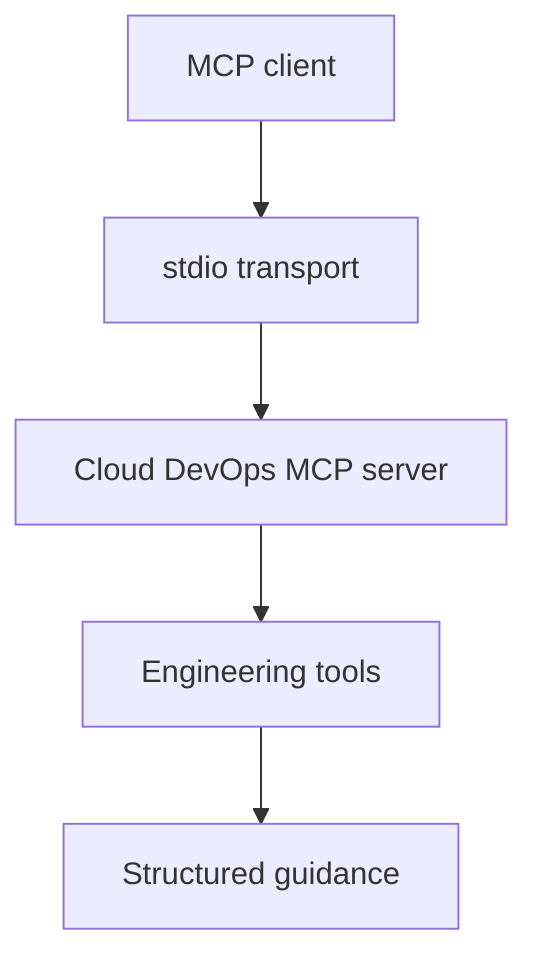

# Cloud DevOps MCP Server

Cloud DevOps MCP Server is a Model Context Protocol server by Alex C. Godwin. It gives AI clients practical Cloud DevOps tools for infrastructure risk review, incident response, CI/CD readiness and SLO error budget analysis.

This project is intentionally focused on engineering judgment rather than generic chat. The server exposes tools that return structured operational guidance an assistant can use during platform work, pull request review, production readiness checks and incident preparation.

## Why this exists

AI assistants are more useful in engineering work when they can call focused tools with clear inputs and consistent outputs. This server provides a Cloud DevOps tool layer for:

- Infrastructure-as-code deployment risk analysis.
- Production incident runbook generation.
- CI/CD delivery readiness review.
- SLO error budget calculations.

## Tools

| Tool | Purpose |
| --- | --- |
| `assess_terraform_change` | Scores Terraform or IaC deployment risk using changed resource classes and release controls. |
| `build_incident_runbook` | Produces a practical incident response runbook for a service, symptom, environment and severity. |
| `review_cicd_pipeline` | Reviews CI/CD maturity and recommends gates for safer production delivery. |
| `estimate_slo_error_budget` | Calculates remaining downtime and optional request failure budget for an SLO window. |

## Architecture



## Quickstart

```bash
git clone https://github.com/alexcgodwin/cloud-devops-mcp-server.git
cd cloud-devops-mcp-server
npm install
npm run build
npm test
```

Run the server locally:

```bash
npm start
```

## MCP client configuration

Use the built `dist/index.js` file from your local checkout.

```json
{
  "mcpServers": {
    "cloud-devops": {
      "command": "node",
      "args": ["/absolute/path/to/cloud-devops-mcp-server/dist/index.js"]
    }
  }
}
```

## Example tool input

```json
{
  "changedResources": ["network", "iam", "kubernetes"],
  "includesIamChanges": true,
  "includesPublicIngress": true,
  "modifiesStatefulResources": false,
  "hasRollbackPlan": true,
  "hasPeerReview": true,
  "hasTerraformPlan": true
}
```

Example output shape:

```json
{
  "riskScore": 60,
  "riskLevel": "high",
  "changedResources": ["network", "iam", "kubernetes"],
  "recommendedReleasePath": "Use staged rollout, peer review and post-apply validation before broad release."
}
```

## Development

```bash
npm run dev
npm run build
npm test
npm run check
```

The core decision logic lives in `src/logic.ts` and the MCP tool registration lives in `src/index.ts`.

## Security model

- The server runs locally over stdio.
- It does not require cloud credentials.
- It does not call external APIs.
- It does not write to infrastructure or mutate user systems.
- It returns advisory guidance only; engineers remain responsible for review, approval and execution.

## Roadmap

- Add Kubernetes deployment review.
- Add AWS IAM policy review helpers.
- Add Terraform plan JSON parsing.
- Add GitHub Actions workflow analysis.
- Add optional HTTP transport after the local stdio server is stable.

## Author

Built by [Alex C. Godwin](https://github.com/alexcgodwin), Cloud DevOps Engineer.
