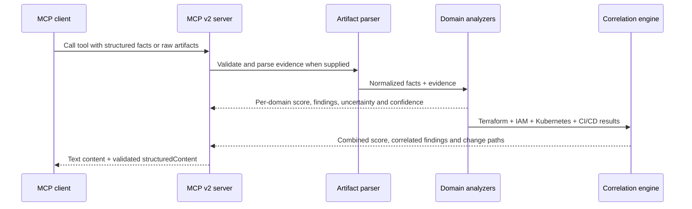

# Architecture

Cloud DevOps MCP Server v0.3 is a local stdio MCP v2 server built on the 2026-07-28 protocol line. It exposes deterministic, read-only Cloud DevOps analysis tools plus a cross-domain correlation engine.

## Runtime flow

## Correlation model

`assess_cloud_change_bundle` requires at least two evidence domains. It preserves each analyzer's independent result and then evaluates combinations that create larger release risk across layers.

The combined score is auditable:

1. A base risk score is calculated from the highest domain risk and the average domain risk.
2. Cross-domain rules add a bounded correlation adjustment.
3. Production and staging add a small explicit environment adjustment.
4. The final score is capped at 100.

The output exposes all three components so reviewers can reconstruct why the bundle score changed.

## Design principles

- Keep the server credential-free and zero-cost for local advisory use.
- Prefer evidence from Terraform plans, IAM policies, Kubernetes manifests and workflow YAML.
- Never convert absent optional evidence into an automatic failure.
- Keep domain findings separate from correlated findings.
- Return structured, auditable results with rule IDs, evidence, confidence and remediation.
- Keep cloud execution and infrastructure mutation out of scope until separate safety controls exist.
- Keep protocol code in `src/index.ts` and deterministic analysis in `src/logic.ts`.

## Safety boundary

The current server does not deploy, modify or delete infrastructure. It does not call cloud APIs or require cloud credentials. Raw artifacts are parsed in-process and are not uploaded by the server.
