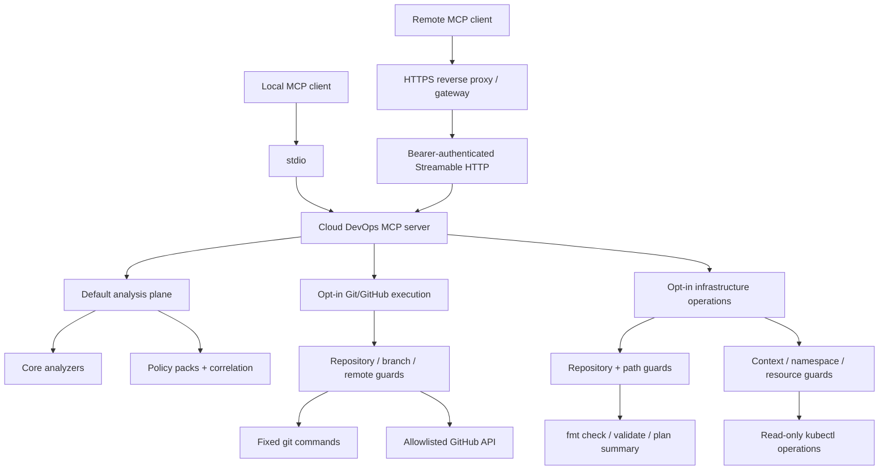

# Architecture

Cloud DevOps MCP Server v0.6 is an MCP v2 server built on the 2026-07-28 protocol line. Stdio is the default local transport. Authenticated Streamable HTTP is optional for self-hosted remote access.

## Runtime planes

The server has three deliberately separated planes:

1. **Analysis plane** - the default twelve tools. They parse caller-supplied evidence in-process and remain read-only.
2. **Controlled Git/GitHub execution plane** - optional tools for status, fetch, fast-forward pull, branch creation, selected-file commit, push, pull requests, CI status, gated merge and allowlisted workflow dispatch.
3. **Infrastructure operations plane** - optional Terraform validation/plan-summary tools and Kubernetes read-only runtime inspection.

The two operational planes are disabled unless their explicit environment gates are enabled.

## Analysis layers

Core analyzers in `src/logic.ts` cover Terraform change risk, incident response, CI/CD readiness, SLOs, AWS IAM, Kubernetes readiness, GitHub Actions and cross-domain release correlation.

Advanced policy packs in `src/intelligence.ts` cover AWS/Azure/GCP identity policy, Terraform security, Kubernetes security policy and SBOM/software supply-chain analysis.

Missing evidence is treated as unknown rather than silently converted into a failed control.

## Controlled execution layer

`src/execution.ts` never exposes a generic command runner. It uses fixed Git subcommands and allowlisted GitHub API operations.

Controls include:

- Execution disabled by default.
- Absolute repository allowlist.
- Protected-branch blocking.
- Allowed branch prefixes and remotes.
- Fast-forward-only pull.
- Selected-file staging for commits.
- No force-push implementation.
- Dry-run support for commit/push paths.
- CI checks before merge.
- Exact confirmation strings for merge and workflow dispatch.
- JSONL audit logging with token redaction.

## Infrastructure operations layer

`src/infrastructure.ts` is a second opt-in boundary.

Terraform controls:

- `terraform fmt -check -recursive -diff` only; files are not rewritten.
- `terraform validate -json`.
- `terraform plan` with `-refresh=false`, `-lock=false`, `-input=false` and a temporary plan file.
- Plan results are reduced to action counts; full plan JSON is not returned.
- No `terraform apply`, destroy, import, state mutation or arbitrary Terraform subcommand tool exists.
- Terraform var-files must resolve inside the allowlisted working directory.

Kubernetes controls:

- Explicit context allowlist.
- Explicit namespace allowlist.
- Explicit resource-type allowlist.
- Bounded metadata/status summaries only.
- Secrets are excluded from the default resource allowlist.
- Rollout status uses `--watch=false` and a bounded timeout.
- No apply, create, patch, edit, delete, exec, cp, port-forward or arbitrary kubectl command tool exists.

## Identity and security policy packs

`review_cloud_identity_policy` selects AWS IAM, Azure RBAC or GCP IAM rule packs. Terraform and Kubernetes security analyzers remain artifact-based and separate from the optional operational tools.

## Supply-chain model

`review_software_supply_chain` parses CycloneDX or SPDX JSON and correlates SBOM quality with CI action pinning, runtime image immutability, signing and provenance.

The release workflow also publishes npm packages through GitHub Actions OIDC. v0.6 adds MCP Registry publication through GitHub OIDC after the exact npm version becomes publicly visible. The MCP publisher binary is version-pinned and SHA-256 verified before execution.

## HTTP security boundary

HTTP mode uses the official MCP v2 server, Node adapter and Fastify adapter.

Controls include bearer authentication, timing-safe comparison, Host/Origin validation, explicit host allowlists and an HTTPS public base URL requirement for non-local binding.

## Safety boundary

Default analysis never calls cloud providers or mutates user systems. Optional Git/GitHub and infrastructure operations may access configured repositories, GitHub, Terraform providers or Kubernetes clusters only after explicit enablement and allowlisting.

The server intentionally does not provide generic shell execution, Terraform apply/destroy, Kubernetes mutation, Kubernetes Secrets retrieval by default, or force-push.
