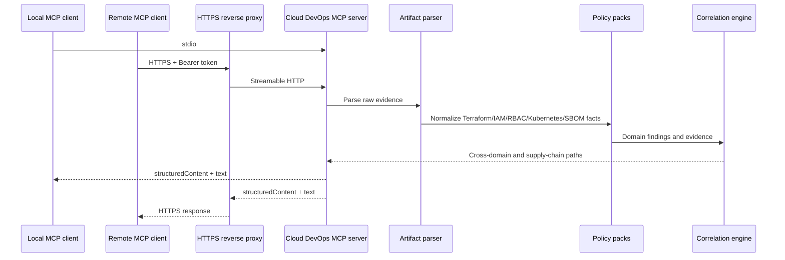

# Architecture

Cloud DevOps MCP Server v0.4 is a read-only MCP v2 server built on the 2026-07-28 protocol line. Stdio is the default local transport. An optional authenticated Streamable HTTP mode is available for self-hosted remote access.

## Runtime flow

## Analysis layers

The v0.4 analyzer is split into two layers:

1. Core operational analyzers in `src/logic.ts` cover Terraform change risk, incident response, CI/CD readiness, SLOs, AWS IAM, Kubernetes readiness, GitHub Actions and cross-domain release correlation.
2. Advanced policy packs in `src/intelligence.ts` cover AWS/Azure/GCP identity policy, Terraform security, Kubernetes security policy and SBOM/software supply-chain analysis.

Every tool remains deterministic and read-only.

## Identity policy packs

`review_cloud_identity_policy` selects a provider-specific rule pack:

- AWS IAM: administrative wildcards, `iam:PassRole`, `sts:AssumeRole`, IAM mutation actions and missing conditions.
- Azure RBAC: wildcard actions/data actions, Owner/Contributor scope, role-assignment mutation and tenant/root assignable scope.
- GCP IAM: Owner/Editor, service-account token creation/impersonation, public principals, missing conditions and risky custom-role permissions.

## Terraform security model

`review_terraform_security` inspects plan JSON for destructive stateful actions, resource replacement, unrestricted CIDRs, sensitive public ports, public data services, encryption disabled, deletion protection disabled, S3 public-access controls and IAM wildcard signals.

## Kubernetes security model

`review_kubernetes_security` evaluates privileged containers, privilege escalation, root execution, host namespaces, hostPath, dangerous Linux capabilities, hostPort, default service-account token use, seccomp, read-only root filesystems and public exposure without NetworkPolicy.

## Supply-chain model

`review_software_supply_chain` parses CycloneDX or SPDX JSON and measures component metadata quality. When workflow YAML or Kubernetes manifests are supplied, it also correlates mutable GitHub Actions and mutable image references. Artifact signing and SLSA-style provenance can be supplied as explicit evidence.

## HTTP security boundary

HTTP mode uses the official MCP v2 `createMcpHandler` entry, the Node adapter and the MCP Fastify adapter.

Controls:

- Explicit `--http` opt-in.
- Bearer token required, minimum 32 characters.
- Timing-safe token comparison.
- Host and Origin validation.
- Non-local binding requires `CLOUD_DEVOPS_MCP_ALLOWED_HOSTS`.
- Non-local binding also requires an HTTPS `CLOUD_DEVOPS_MCP_PUBLIC_BASE_URL`, representing TLS termination at a reverse proxy or gateway.
- Stdio remains credential-free and unchanged.

The static bearer mode is appropriate for a private self-hosted endpoint. A multi-user public service should use OAuth/OIDC authentication at a gateway or a future OAuth resource-server implementation.

## Safety boundary

The server does not deploy, modify or delete infrastructure. It does not execute supplied Terraform, Kubernetes or workflow code. It does not call cloud provider APIs. Raw artifacts are parsed in-process and are not uploaded by the server.
