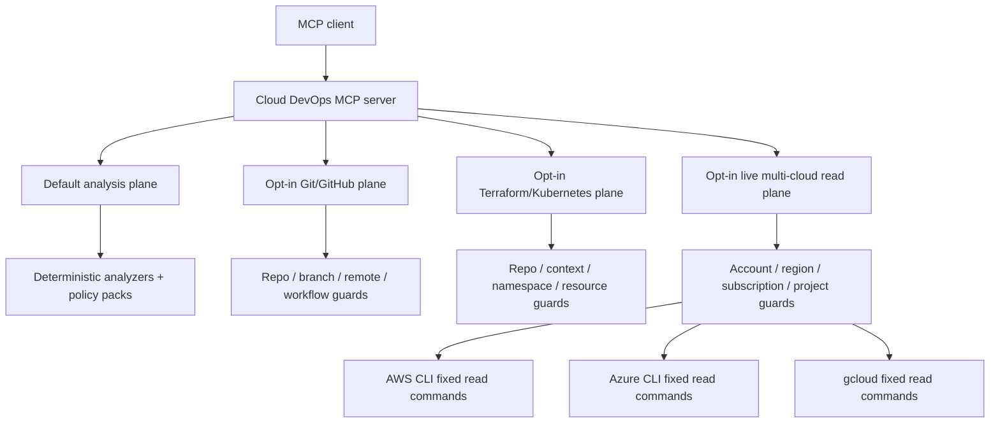

# Architecture

Cloud DevOps MCP Server v0.7 is an MCP v2 server built on the 2026-07-28 protocol line. Stdio is the default local transport. Authenticated Streamable HTTP is optional for self-hosted remote access.

## Runtime planes

The server has four separated capability planes:

1. **Analysis plane** - twelve evidence-backed tools exposed by default. They parse caller-supplied evidence and remain read-only.
2. **Controlled Git/GitHub execution plane** - optional guarded Git and GitHub operations.
3. **Infrastructure operations plane** - optional Terraform validation/plan summaries and Kubernetes read-only runtime inspection.
4. **Live multi-cloud read plane** - optional AWS, Azure and GCP inventory, managed Kubernetes, observability, FinOps and drift signals.

Each operational plane has its own explicit environment gate. The live cloud plane does not accept provider credentials as MCP arguments; it relies on the host's existing cloud CLI authentication plus scope allowlists.

## Analysis layers

`src/logic.ts` covers Terraform change risk, incident response, CI/CD readiness, SLOs, AWS IAM, Kubernetes readiness, GitHub Actions and cross-domain release correlation.

`src/intelligence.ts` covers AWS/Azure/GCP identity policy packs, Terraform security, Kubernetes security and SBOM/software supply-chain analysis.

Missing evidence is treated as unknown rather than silently converted into a failed control.

## Controlled execution layer

`src/execution.ts` uses fixed Git subcommands and allowlisted GitHub API operations. It exposes no generic command runner, no force-push, blocks direct mutation of protected branches, stages only selected files, requires passing checks before merge and requires exact confirmation strings for higher-impact GitHub actions.

## Infrastructure operations layer

`src/infrastructure.ts` provides check-only Terraform formatting, `terraform validate -json`, non-apply plan summaries, allowlisted Kubernetes metadata/status reads and bounded rollout checks.

It deliberately exposes no Terraform apply/destroy/state mutation and no Kubernetes apply/create/patch/edit/delete/exec/cp/port-forward surface.

## Live multi-cloud read layer

`src/cloud.ts` uses only fixed provider CLI command shapes.

AWS controls:

- Explicit account and region allowlists.
- Optional profile allowlist.
- STS caller-account verification before AWS resource reads.
- Bounded inventory through Resource Groups Tagging API.
- EKS cluster listing.
- CloudWatch alarm summaries.
- FinOps signals from available EBS volumes and unassociated Elastic IPs.

Azure controls:

- Explicit subscription allowlist.
- Azure Resource Manager resource inventory.
- AKS cluster listing.
- Metric-alert summaries.
- FinOps signals from unattached disks and unassociated public IPs.

GCP controls:

- Explicit project allowlist.
- Cloud Asset Inventory search.
- GKE cluster listing.
- Logging-sink summaries.
- FinOps signals from unused persistent disks and reserved static IPs.

Live inventory is normalized to bounded metadata. Provider tokens, keys and full arbitrary provider responses are not returned. The drift tool reports differences only; it has no reconciliation path.

## Audit and redaction

Operational layers write JSONL audit records to `CLOUD_DEVOPS_MCP_AUDIT_LOG` or the operating-system temporary directory. Known token/access-key patterns are redacted before audit detail is written.

## Release supply chain

Releases run the quality gate, publish npm through GitHub Actions OIDC with provenance, wait for public npm availability, verify the pinned MCP Registry publisher by SHA-256, authenticate to the MCP Registry with GitHub OIDC and publish the matching `server.json`.

## HTTP security boundary

HTTP mode requires explicit opt-in, bearer authentication, timing-safe comparison, Host/Origin validation and an HTTPS public base URL for non-local binding.

## Safety boundary

Default analysis remains read-only and credential-free. Optional cloud/infrastructure access must be explicitly enabled and allowlisted.

The server intentionally does not provide generic shell execution, force-push, Terraform apply/destroy, Kubernetes mutation, or cloud resource mutation tools.
