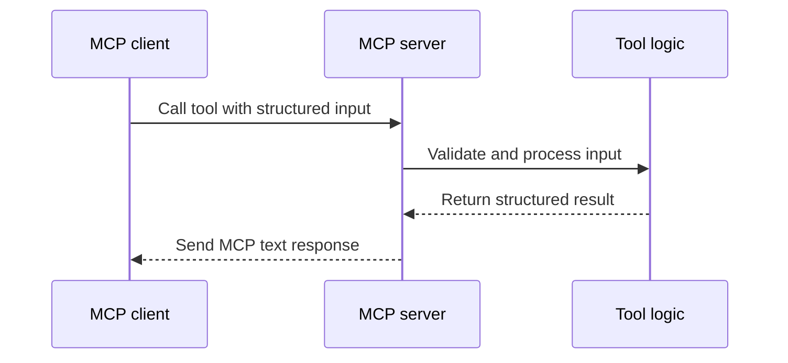

# Architecture

Cloud DevOps MCP Server is a local stdio MCP server. It is designed to run inside an MCP-compatible client and expose deterministic tools for Cloud DevOps analysis.

## Runtime flow

## Design principles

- Keep the first release credential-free and zero-cost.
- Prefer clear inputs over broad natural-language prompts.
- Return structured guidance that can be reviewed and audited.
- Keep cloud execution out of scope until safety controls are explicit.

## Tool boundary

This server does not deploy, modify infrastructure, delete resources or connect to cloud accounts. It provides engineering analysis that can support human review.
