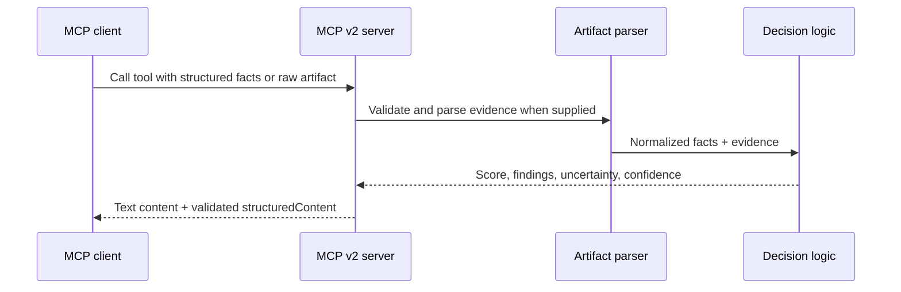

# Architecture

Cloud DevOps MCP Server v0.2 is a local stdio MCP v2 server built on the 2026-07-28 protocol line. It exposes deterministic, read-only Cloud DevOps analysis tools.

## Runtime flow

## Design principles

- Keep the server credential-free and zero-cost for local advisory use.
- Prefer evidence from Terraform plans, IAM policies, Kubernetes manifests and workflow YAML.
- Never convert absent optional evidence into an automatic failure.
- Return structured, auditable results with rule-tagged evidence.
- Keep cloud execution and infrastructure mutation out of scope until separate safety controls exist.
- Keep protocol code in `src/index.ts` and deterministic analysis in `src/logic.ts`.

## Safety boundary

The current server does not deploy, modify or delete infrastructure. It does not call cloud APIs or require cloud credentials. Raw artifacts are parsed in-process and are not uploaded by the server.
