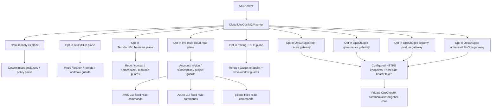

# Architecture

Cloud DevOps MCP Server v0.13 is an MCP v2 server built on the 2026-07-28 protocol line. Stdio is the default local transport. Authenticated Streamable HTTP is optional for self-hosted remote access.

## Runtime planes

The server has ten separated capability planes:

1. **Analysis plane** - twelve evidence-backed tools exposed by default. They parse caller-supplied evidence and remain read-only.
2. **Controlled Git/GitHub execution plane** - optional guarded Git and GitHub operations.
3. **Infrastructure operations plane** - optional Terraform validation/plan summaries and Kubernetes read-only runtime inspection.
4. **Live multi-cloud read plane** - optional AWS, Azure and GCP inventory, managed Kubernetes, observability, FinOps and drift signals.
5. **Production observability and operations-intelligence plane** - optional bounded Prometheus, Grafana, CloudWatch Logs, Kubernetes health and GitHub Actions failure diagnostics plus cross-signal correlation, cloud-health scoring, deployment correlation, coverage assessment, FinOps correlation, cross-runtime drift analysis and operations briefs.
6. **Distributed tracing and SLO-intelligence plane** - optional bounded Grafana Tempo and Jaeger v3 trace reads plus service dependency mapping, tracing coverage, multi-window SLO burn-rate analysis and trace/SLO incident correlation.
7. **OpsChugex root-cause gateway** - optional authenticated forwarding of bounded multi-domain incident evidence to the private OpsChugex root-cause engine. The public server contains the contract and transport guardrails, not the proprietary ranking logic.
8. **OpsChugex governance gateway** - optional authenticated forwarding of bounded resource evidence and time-bounded exceptions to the private OpsChugex policy engine. The public server contains no proprietary profiles, policy rules, scoring weights or enforcement logic.
9. **OpsChugex security posture gateway** - optional authenticated forwarding of bounded asset, identity, secret and network evidence to the private OpsChugex security engine. The public server contains no proprietary detection thresholds, scoring rules or attack-path correlation logic.
10. **OpsChugex advanced FinOps gateway** - optional authenticated forwarding of bounded cloud-cost, utilization and Kubernetes allocation evidence to the private OpsChugex FinOps engine. The public server contains no proprietary savings factors, anomaly thresholds, prioritization or deduplication logic.

Each operational plane has its own explicit environment gate. The live cloud plane does not accept provider credentials as MCP arguments; it relies on the host's existing cloud CLI authentication plus scope allowlists.

## Analysis layers

`src/logic.ts` covers Terraform change risk, incident response, CI/CD readiness, SLOs, AWS IAM, Kubernetes readiness, GitHub Actions and cross-domain release correlation.

`src/intelligence.ts` covers AWS/Azure/GCP identity policy packs, Terraform security, Kubernetes security and SBOM/software supply-chain analysis.

Missing evidence is treated as unknown rather than silently converted into a failed control.

## Controlled execution layer

`src/execution.ts` uses fixed Git subcommands and allowlisted GitHub API operations. It exposes no generic command runner, no force-push, blocks direct mutation of protected branches, stages only selected files, requires passing checks before merge and requires exact confirmation strings for higher-impact GitHub actions.

## Infrastructure operations layer

`src/infrastructure.ts` provides check-only Terraform formatting, `terraform validate -json`, non-apply plan summaries, allowlisted Kubernetes metadata/status reads and bounded rollout checks.

It deliberately exposes no Terraform apply/destroy/state mutation and no Kubernetes apply/create/patch/edit/delete/exec/cp/port-forward surface.

## Live multi-cloud read layer

`src/cloud.ts` uses only fixed provider CLI command shapes.

AWS controls:

- Explicit account and region allowlists.
- Optional profile allowlist.
- STS caller-account verification before AWS resource reads.
- Bounded inventory through Resource Groups Tagging API.
- EKS cluster listing.
- CloudWatch alarm summaries.
- FinOps signals from available EBS volumes and unassociated Elastic IPs.

Azure controls:

- Explicit subscription allowlist.
- Azure Resource Manager resource inventory.
- AKS cluster listing.
- Metric-alert summaries.
- FinOps signals from unattached disks and unassociated public IPs.

GCP controls:

- Explicit project allowlist.
- Cloud Asset Inventory search.
- GKE cluster listing.
- Logging-sink summaries.
- FinOps signals from unused persistent disks and reserved static IPs.

Live inventory is normalized to bounded metadata. Provider tokens, keys and full arbitrary provider responses are not returned. The drift tool reports differences only; it has no reconciliation path.

## Production observability plane

`src/observability.ts` provides fixed, read-only integrations for Prometheus-compatible query APIs, Grafana alert APIs, AWS CloudWatch Logs Insights, allowlisted Kubernetes pod health and GitHub Actions run diagnostics. It also includes deterministic correlation across metrics, logs, alerts, Kubernetes and CI/CD evidence.

`src/operations-intelligence.ts` adds supplied-evidence analysis for cloud health, post-deployment incident timelines, observability coverage, FinOps/Terraform ownership correlation, cloud/Kubernetes drift and concise operations briefs. These tools do not query or mutate external systems.

Remote observability endpoints must be exactly allowlisted and use HTTPS unless they are loopback addresses. AWS accounts/regions/log groups, Kubernetes contexts/namespaces and GitHub repositories are separately allowlisted. Query windows and result sizes are bounded, sensitive token patterns are redacted, and host-side credentials are never returned.

## Distributed tracing and SLO-intelligence plane

`src/tracing.ts` provides bounded read access to Grafana Tempo and the stable Jaeger v3 JSON/HTTP query API. It can search traces, retrieve one trace by ID and normalize OpenTelemetry-style resource/span data into bounded summaries. It also provides local analysis for service dependency maps, tracing instrumentation coverage, multi-window SLO burn rates and trace/SLO incident correlation.

The tracing plane is disabled by default and requires `CLOUD_DEVOPS_MCP_TRACING_ENABLED=true`. Tempo and Jaeger base URLs must be explicitly allowlisted and use HTTPS unless they are loopback addresses. Bearer tokens are host-managed environment variables and are never accepted as MCP tool arguments. Trace searches are capped at six-hour windows and 100 summaries; trace normalization is bounded to 5,000 spans.

The plane exposes no OTLP ingestion, trace deletion, sampling-policy mutation, storage mutation or arbitrary backend API access. Correlation reports evidence strength and deliberately does not assign root cause.

## OpsChugex root-cause gateway

`src/opschugex.ts` contains the public v0.10 request/response contract and guarded HTTPS client for root-cause intelligence. The host supplies the endpoint and bearer token. MCP callers cannot supply either value.

The root-cause ranking algorithm, cause-family weights, contradiction handling and commercial correlation logic remain in the private OpsChugex core.

## OpsChugex governance gateway

`src/opschugex-governance.ts` contains only the public v0.11 governance contract and guarded HTTPS client. It accepts bounded resource facts and optional owner-attributed, time-bounded exception metadata.

The development, staging, production and regulated profiles, control rules, scoring weights, exception evaluation and future enforcement logic remain in the private OpsChugex core. The public gateway validates request/response shapes and exposes no policy mutation or infrastructure enforcement path.

## Audit and redaction

Operational layers write JSONL audit records to `CLOUD_DEVOPS_MCP_AUDIT_LOG` or the operating-system temporary directory. Known token/access-key patterns are redacted before audit detail is written.

## Release supply chain

Releases run the quality gate, publish npm through GitHub Actions OIDC with provenance, wait for public npm availability, verify the pinned MCP Registry publisher by SHA-256, authenticate to the MCP Registry with GitHub OIDC and publish the matching `server.json`.

## HTTP security boundary

HTTP mode requires explicit opt-in, bearer authentication, timing-safe comparison, Host/Origin validation and an HTTPS public base URL for non-local binding.

## Safety boundary

Default analysis remains read-only and credential-free. Optional cloud/infrastructure access must be explicitly enabled and allowlisted.

The server intentionally does not provide generic shell execution, force-push, Terraform apply/destroy, Kubernetes mutation, or cloud resource mutation tools.

## OpsChugex cloud security posture gateway

`src/opschugex-security.ts` contains only the v0.12 public contract, bounded schemas and guarded HTTPS client.

The private OpsChugex core owns security detection rules, severity thresholds, security scoring and attack-path correlation. The public gateway accepts bounded asset, identity, secret and network-reachability evidence and validates the private response before returning it to the MCP client.

The gateway is disabled by default. Remote endpoints require HTTPS, the service URL and bearer token are host-managed, and neither can be supplied by an MCP caller.

The gateway exposes no credential rotation, IAM mutation, network mutation, encryption mutation or infrastructure remediation path.

## OpsChugex advanced FinOps gateway

`src/opschugex-finops.ts` contains only the v0.13 public contract, bounded schemas and guarded HTTPS client.

The private OpsChugex core owns idle-resource thresholds, rightsizing logic, savings ranges, cost-anomaly thresholds, commitment and spot prioritization, Kubernetes over-request analysis, confidence logic and portfolio savings deduplication.

The gateway is disabled by default. Remote endpoints require HTTPS, the service URL and bearer token are host-managed, and neither can be supplied by an MCP caller.

The gateway exposes no instance resize, resource termination, commitment purchase, Kubernetes mutation, storage-tier mutation or provider billing action.
